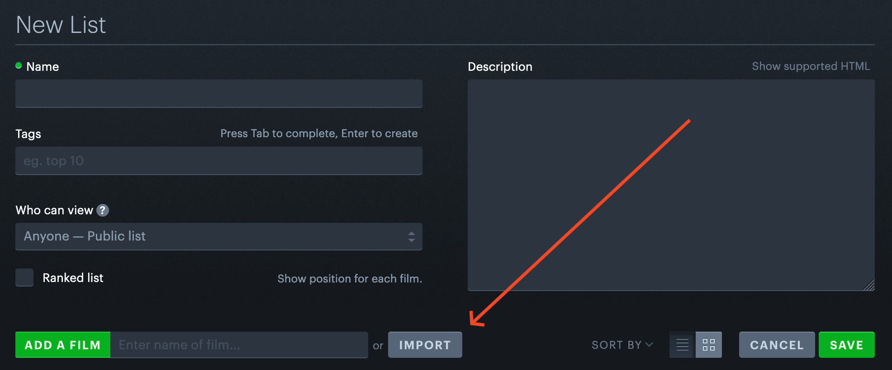

# imdb-search-export

Tool for creating Letterboxd lists from [IMDb advanced search results](https://www.imdb.com/search/title/).

## How to use

1. Clone this repo
2. Install dependencies `npm i` (but i recommend `pnpm`)
3. Set desired values in `index.ts`
4. Run `npm run start` and wait until `list.csv` appears
5. [Import `list.csv` to letterboxd](https://letterboxd.com/list/new/)

   
